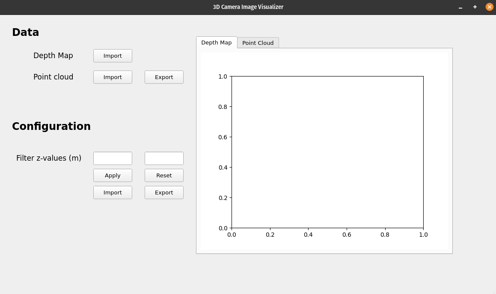
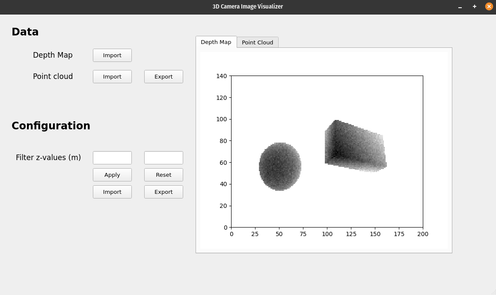
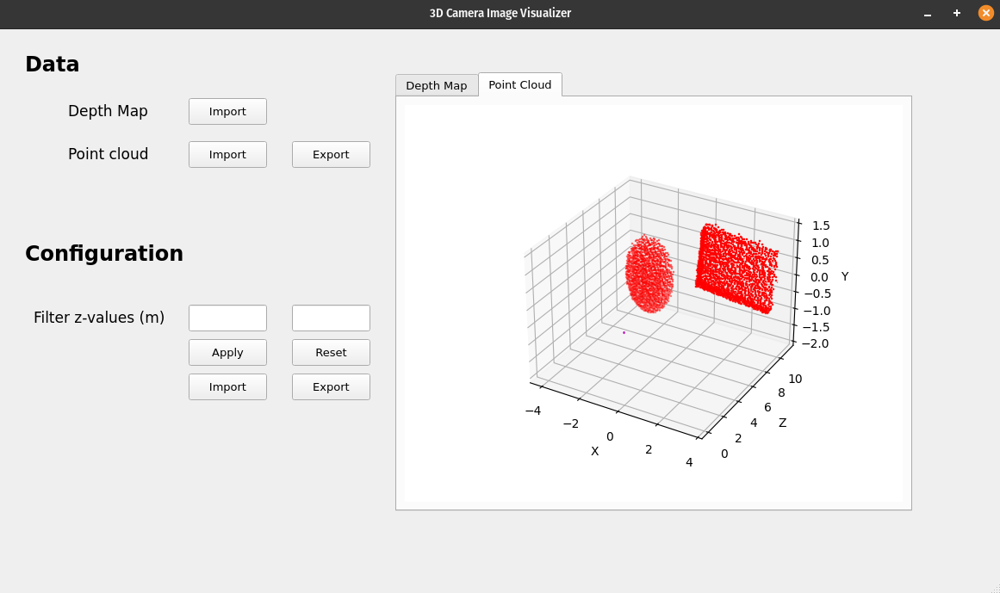
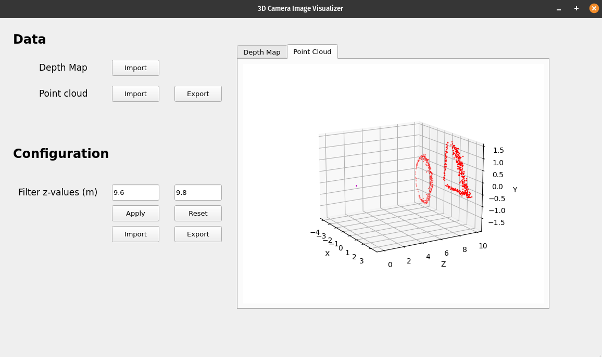

# Image visualizer

This is an image visualizer desktop app made as a text exercise (I received permission to use it in my portfolio)

The app is written in Python3 and is based on PyQt.

The app visualizes DepthMap and PointCloud data captured from 3D cameras.

## Installing a .deb package

Go to this [link](https://livettu-my.sharepoint.com/:u:/g/personal/sejego_ttu_ee/EWTO6SkVDyRGnlk-o8LnH4YBJJ4_AT3x2TTp4gkMfM7vpA?e=AzNkh3) and download the .deb package.

Navigate to the folder where the .deb package is installed and do the following:

`sudo dpkg -i image-visualizer.deb`

After that navigate to the file Explorer and find the Executable names "Image Visualizer".

## Python3 and Pip

Install the required packages using pip:

`pip install -r requirements.txt`

And launch the app:

`python3 main.py`

## Example files

All example files exist in the folder *example_files*

# Assumptions

This app was created with following assumptions:

1. Loading a DepthMap file would overwrite the existing PointCloud imported from CSV file.
2. CSV file describing PointCloud is in format < x, y, z> and **must include a header**.
3. PointCloud can be reset to the initially loaded one by pressing "Reset" button
4. Configuration can be written by inputting numbers into the Config fields or my importing. Import format is YAML:
    ```yaml
        z_max: 2.04
        z_min: 15.04
    ```
4. Configuration sets the range of Z-values, outside of which all point cloud points are removed on the 3D Plot.

# Screenshots

#### On startup

#### DepthMap

#### PointCloud

#### PointCloud filtered by Z-values
